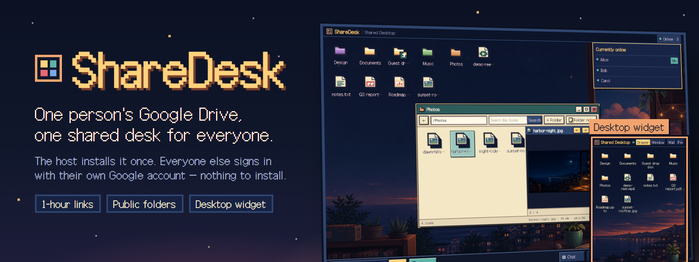
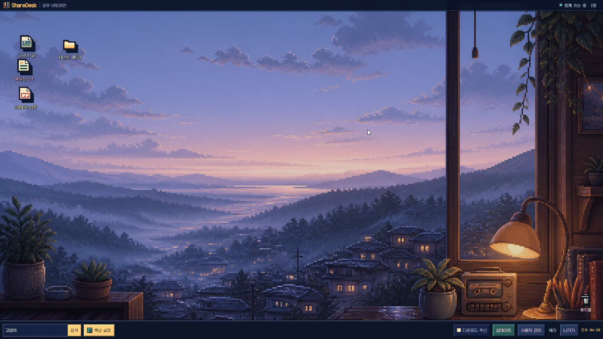
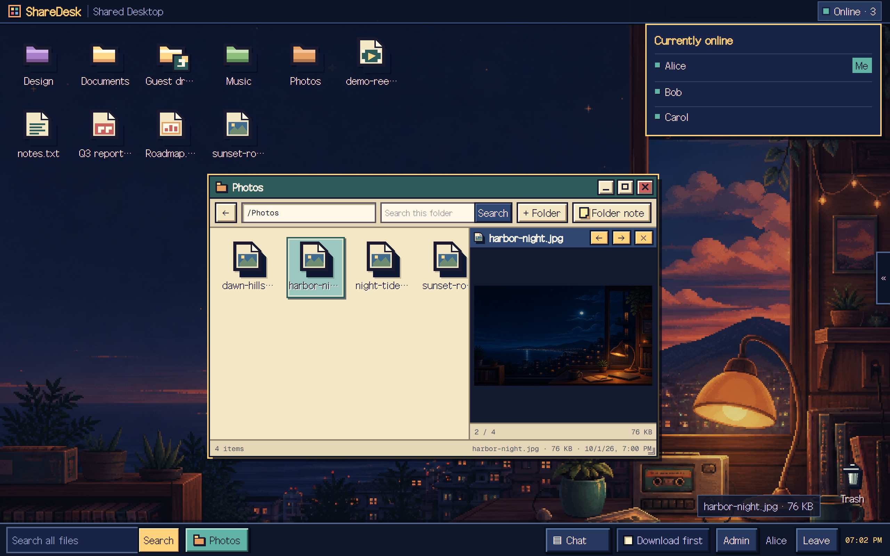
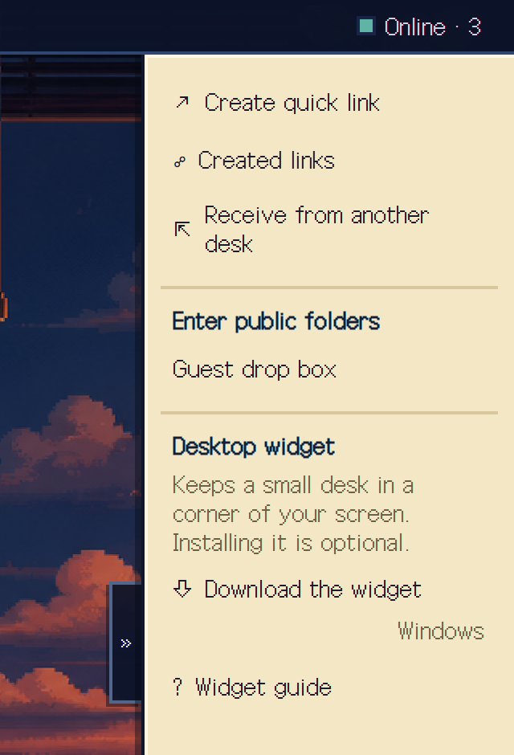
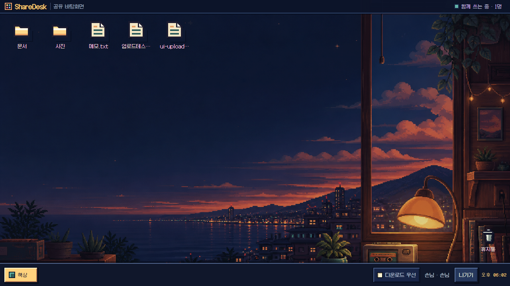
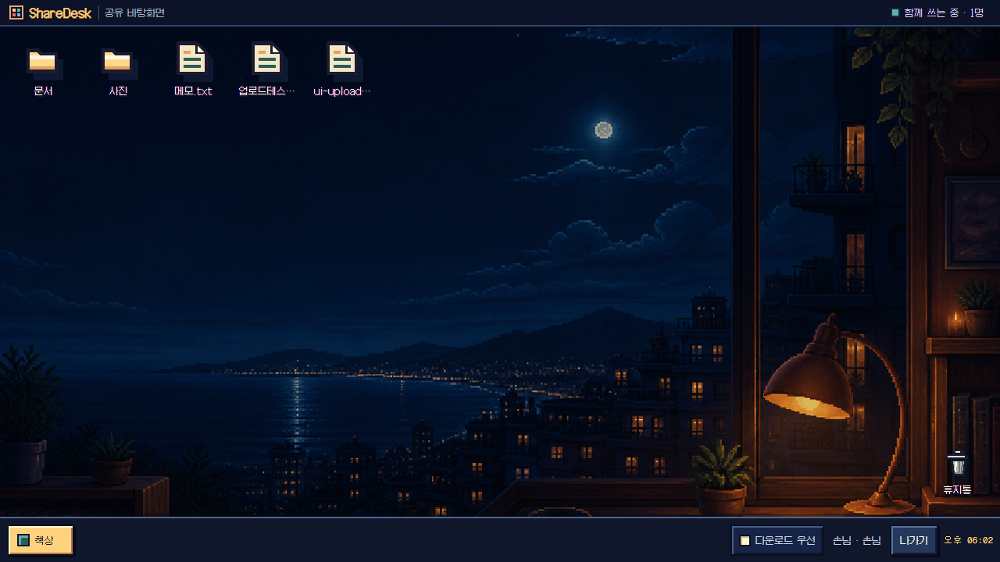
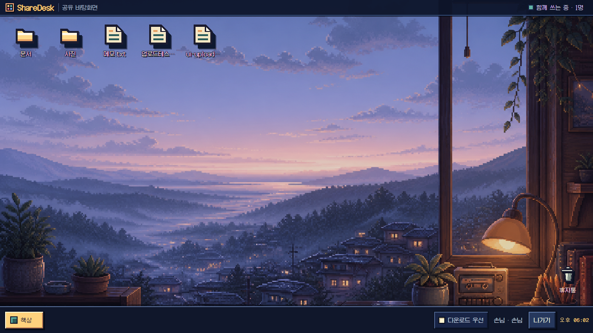
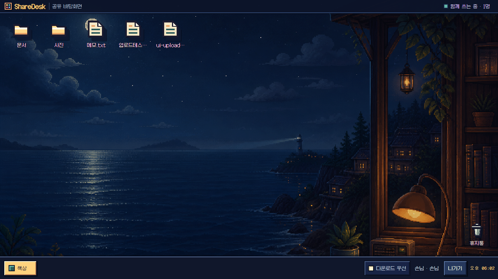
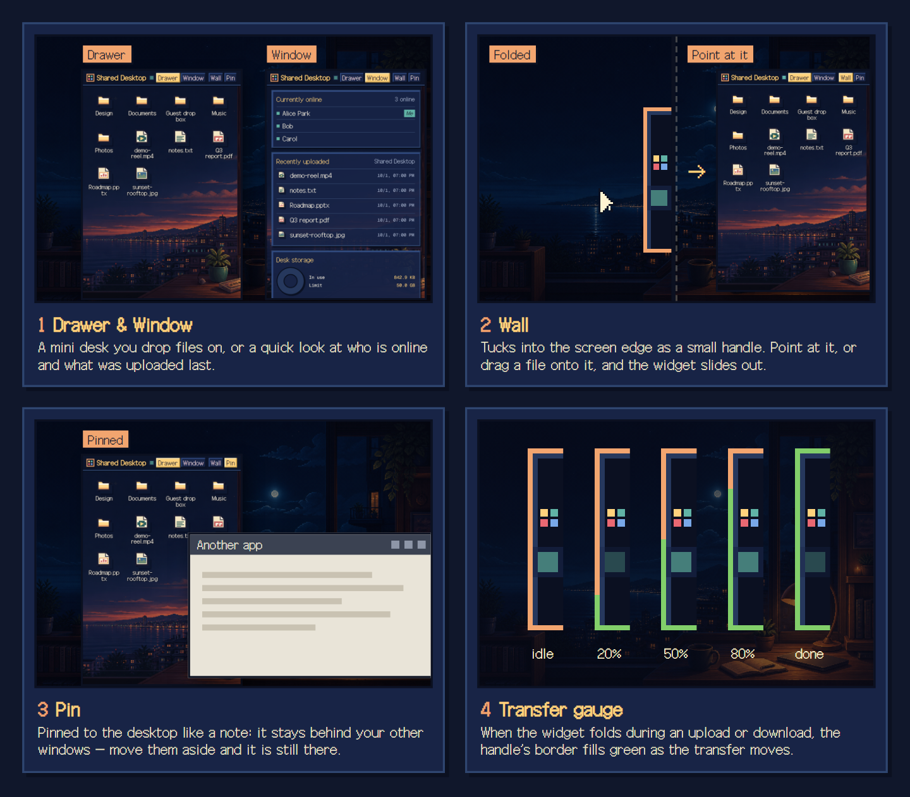

<p align="center">
  
</p>

<p align="center">
  <a href="LICENSE"></a>
  
  
  
  <a href="#डेस्कटॉप-विजेट"></a>
</p>

<p align="center">
  <strong>एक पिक्सेल-आर्ट डेस्कटॉप, जहाँ पूरा समूह एक ही Google Drive साझा करता है।</strong><br />
  होस्ट इसे एक बार तैयार करता है। बाकी लोग बस पता खोलते हैं और अपने Google खाते से साइन इन करते हैं।
</p>

<p align="center">
  <a href="#sharedesk-क्या-है">परिचय</a> ·
  <a href="#डेस्क">डेस्क</a> ·
  <a href="#साझा-करना-और-स्पेस">साझा करना</a> ·
  <a href="#चार-वॉलपेपर">वॉलपेपर</a> ·
  <a href="#डेस्कटॉप-विजेट">विजेट</a> ·
  <a href="#शुरुआत-करें">शुरुआत</a> ·
  <a href="#साझा-कैसे-होता-है">साझा कैसे होता है</a>
</p>

<div align="center">

[English](./README.md) · [한국어](./README.ko.md) · [日本語](./README.ja.md) · **हिन्दी** · [中文](./README.zh.md)

</div>

<br />

## ShareDesk क्या है?

ShareDesk **एक साझा फ़ाइल स्पेस है, जहाँ कई लोग एक व्यक्ति के Google Drive स्टोरेज को अपने-अपने Google खातों से मिलकर इस्तेमाल करते हैं**। इसे सिर्फ़ होस्ट को एक बार इंस्टॉल करना होता है। बाकी लोग उसी पते को खोलते हैं, Google से साइन इन करते हैं, पहली बार आमंत्रण कोड डालते हैं और फिर ब्राउज़र के पिक्सेल-आर्ट डेस्कटॉप पर वही फ़ाइलें और फ़ोल्डर साथ मिलकर इस्तेमाल करते हैं।



<sub>यह डेमो कोरियाई इंटरफ़ेस के साथ रिकॉर्ड किया गया है। ShareDesk का इंटरफ़ेस अंग्रेज़ी, कोरियाई, जापानी, हिन्दी और चीनी में उपलब्ध है।</sub>

<details>
<summary><strong>एक Drive साझा डेस्क कैसे बनता है</strong></summary>
<br />

```text
   एक होस्ट का Google Drive
             ↕
    वही एक ShareDesk पता
   ├─ होस्ट का Google खाता
   ├─ प्रतिभागी A का Google खाता
   └─ प्रतिभागी B का Google खाता
```

Google Drive से सिर्फ़ होस्ट का खाता जुड़ता है। प्रतिभागी अपने-अपने Google खातों से साइन इन करते हैं, लेकिन ShareDesk के अंदर सभी लोग होस्ट के चुने हुए एक ही Drive फ़ोल्डर में काम करते हैं और उसका स्टोरेज मिलकर इस्तेमाल करते हैं।
</details>

<br />

## डेस्क

<p align="center">
  
</p>

- **आइकन और विंडो** — फ़ाइलों और फ़ोल्डरों को डेस्कटॉप आइकन की तरह सजाएँ, फ़ोल्डरों को सात में से कोई एक रंग दें, और कई फ़ोल्डरों को विंडो के रूप में खोलें जिन्हें छोटा या बड़ा किया जा सकता है। ट्रैश नीचे दाएँ कोने में रहता है और हटाई गई चीज़ों को 30 दिन तक रखता है।
- **प्रीव्यू और साथ में संपादन** — फ़ोटो, वीडियो, ऑडियो, PDF और टेक्स्ट वहीं खुल जाते हैं, और `.txt` फ़ाइलें कई लोग साथ मिलकर संपादित कर सकते हैं। हर फ़ोल्डर पर एक साझा नोट रखा जा सकता है।
- **खोजें** — पूरे डेस्क में या किसी एक फ़ोल्डर और उसके सब-फ़ोल्डरों में खोजें, और **गुण** खोलकर देखें कि फ़ाइल किसने अपलोड की और वह कितनी बार डाउनलोड हुई।
- **अपने तरीके से अपलोड करें** — फ़ाइलें या पूरे फ़ोल्डर खींचकर छोड़ें। अगर रीफ़्रेश से अपलोड बीच में कट जाए, तो टास्कबार पर बाकी अपलोड वाली चिप खोलें और उसी पैनल में वही फ़ाइल छोड़ें या फ़ाइल दोबारा चुनें, ताकि अपलोड आगे जारी रहे; सीधे डेस्क पर छोड़ने से नया अपलोड शुरू होता है।
- **लोग** — देखें कि अभी कौन ऑनलाइन है, नीचे दाईं ओर के बटन से चैट करें (छोटा किए होने पर नया संदेश आने से बटन चमकता है और न पढ़े संदेशों की संख्या दिखाता है), और वह उपनाम चुनें जो दूसरों को दिखेगा।
- **भूमिकाएँ** — व्यवस्थापक `ADMIN_EMAILS` से तय होते हैं; बाकी लोगों की भूमिका व्यवस्थापक स्क्रीन से हर व्यक्ति के लिए अलग-अलग "संपादित कर सकते हैं", "अपलोड कर सकते हैं" या "केवल देखना" में बदली जाती है।
- **व्यवस्थापक स्क्रीन** — आमंत्रण कोड (एकल-उपयोग या समाप्ति तक असीमित), उपयोगकर्ता और उनके साइन-इन डिवाइस, गतिविधि, सार्वजनिक फ़ोल्डर, डेस्क भाषा, पुरानी डिस्क जैसे डोनट चार्ट के साथ स्टोरेज सीमाएँ, वॉलपेपर और अपडेट।
- **फ़ोन पर** — छोटी स्क्रीन पर डेस्क एक आसान सूची बन जाता है, जहाँ से अपलोड, फ़ोटो लें और नया फ़ोल्डर बनाना संभव है।

<br />

## साझा करना और स्पेस



डेस्क के दाएँ किनारे पर मौजूद `«` हैंडल दबाने से साइडबार खुलता है। लिंक, प्राप्त करना, सार्वजनिक फ़ोल्डर और विजेट डाउनलोड यहीं मिलते हैं।

- **साझा लिंक** — संपादन की अनुमति वाले सदस्य और व्यवस्थापक किसी फ़ाइल या फ़ोल्डर पर राइट-क्लिक करके तुरंत एक घंटे का लिंक कॉपी कर सकते हैं, या साझा लिंक प्रबंधन में 1 घंटा, 24 घंटे, 7 दिन या 30 दिन (डिफ़ॉल्ट 7 दिन) चुन सकते हैं। लिंक बिना साइन इन के खुलते हैं।
- **क्विक लिंक** — फ़ाइलें छोड़ें, और हर फ़ाइल का अपलोड पूरा होते ही उसका एक घंटे का लिंक बन जाता है। विंडो सबसे आगे हो तो कॉपी किया गया स्क्रीनशॉट Ctrl+V से चिपकाने पर भी वह इसी तरह अपलोड होता है। टिक लगी फ़ाइलें एक घंटे बाद हटा दी जाती हैं; टिक हटाने पर फ़ाइल डेस्क पर बनी रहती है।
- **बनाए गए लिंक** — सक्रिय लिंक एक ही सूची में दिखते हैं, जहाँ से उन्हें फिर से कॉपी किया जा सकता है या साझा करना रोका जा सकता है। सामान्य सदस्य सिर्फ़ अपने लिंक देखते हैं; व्यवस्थापक सभी लिंक देखते हैं।
- **QR कोड** — साझा लिंक, क्विक लिंक, आमंत्रण कोड और सार्वजनिक फ़ोल्डर के पते ब्राउज़र में ही बने QR कोड के रूप में दिखाए जा सकते हैं, ताकि फ़ोन से स्क्रीन को स्कैन करके तुरंत ले जाया जा सके।
- **दूसरे डेस्क से प्राप्त करें** — किसी दूसरे ShareDesk पर बना साझा लिंक चिपकाएँ, और वह फ़ाइल या फ़ोल्डर इस डेस्क में कॉपी हो जाएगा।
- **सार्वजनिक फ़ोल्डर** — जब व्यवस्थापक किसी फ़ोल्डर को सार्वजनिक फ़ोल्डर बना देता है, तो पता जानने वाला कोई भी व्यक्ति बिना साइन इन के उसमें डाउनलोड और अपलोड कर सकता है। आकार, फ़ाइलों की संख्या और खुले रहने के समय की सीमाएँ सर्वर लागू करता है। सदस्य इन्हें **सार्वजनिक फ़ोल्डर में जाएँ** में पाते हैं।
- **स्पेस** — व्यवस्थापक एक ही इंस्टॉल में और डेस्क खोल सकता है। हर डेस्क का `/team/files` जैसा अपना पता होता है, और सदस्य, भूमिकाएँ, फ़ाइलें और चैट अलग रहते हैं। लोगों को सिर्फ़ वही स्पेस दिखते हैं जिनमें उन्हें जोड़ा गया है। लिंक और सार्वजनिक फ़ोल्डर अभी केवल मुख्य डेस्क पर चलते हैं।
- **डाउनलोड को प्राथमिकता** — टास्कबार का यह चेकबॉक्स चालू होने पर फ़ाइल खोलते ही प्रीव्यू के बजाय डाउनलोड शुरू होता है।

<br clear="all" />

## चार वॉलपेपर

हर व्यक्ति अपनी स्क्रीन के लिए वॉलपेपर खुद चुनता है, और उसकी पसंद उसी ब्राउज़र में सहेजी जाती है।

| गोधूलि | गहरी रात |
| :---: | :---: |
|  |  |
| **भोर** | **रात का सागर** |
|  |  |

<br />

## डेस्कटॉप विजेट

<p align="center">
  
</p>

<p align="center">
  <a href="https://github.com/Youkamii/sharedesk-template/releases/download/widget/sharedesk-widget-windows-x64-setup.exe"></a>
</p>

विजेट वैकल्पिक है। यह एक छोटी विंडो है जो आपके डेस्क का पता ही खोलती है, इसलिए स्क्रीन डेस्क सर्वर बनाता है, और विजेट के बिना भी हर सुविधा ब्राउज़र में वैसे ही चलती है। विस्तार से जानने के लिए [डेस्कटॉप विजेट](./docs/WIDGET.hi.md) देखें।

- **हर जगह वही डाउनलोड** — ऊपर का बटन हमेशा नवीनतम Windows इंस्टॉलर की ओर ले जाता है, और सदस्य डेस्क साइडबार के **डेस्कटॉप विजेट** से भी वही फ़ाइल पा सकते हैं। macOS संस्करण Mac पर बनाकर अपलोड किए जाने के बाद मिलेगा।
- **दराज़ और खिड़की** — दराज़ फ़ाइलों का ग्रिड है: फ़ाइलें छोड़ें और वे उसी फ़ोल्डर में अपलोड हो जाती हैं जिसे आप देख रहे हैं। खिड़की दिखाती है कि कौन ऑनलाइन है और हाल में अपलोड हुई पाँच फ़ाइलें कौन-सी हैं; व्यवस्थापकों को डेस्क स्टोरेज भी दिखता है।
- **दीवार** — विजेट को पास वाले स्क्रीन किनारे में छिपा देता है और सिर्फ़ एक छोटा हैंडल छोड़ता है। हैंडल पर माउस ले जाएँ या कोई फ़ाइल उस पर खींचें, तो विजेट बाहर खिसक आता है; सिमटे रहने के दौरान हैंडल के बगल में किया गया क्लिक पीछे वाली विंडो तक पहुँचता है।
- **पिन** — विजेट को पुशपिन की तरह डेस्कटॉप पर टिका देता है, ताकि वह दूसरी विंडो के पीछे और डेस्कटॉप के ऊपर रहे। दीवार और पिन कभी एक साथ चालू नहीं होते।
- **खींचकर बाहर निकालें** — Windows पर दराज़ से किसी फ़ाइल आइकन को एक्सप्लोरर के किसी फ़ोल्डर में खींचें, और फ़ाइल वहीं डाउनलोड हो जाएगी।
- **ट्रांसफ़र गेज** — अगर फ़ाइलें भेजते या पाते समय विजेट सिमट जाए, तो हैंडल का किनारा प्रगति के साथ हरा भरता जाता है, और ट्रांसफ़र विफल होने पर कुछ पल के लिए लाल हो जाता है।
- **अपडेट और प्रोफ़ाइल** — विजेट नए संस्करण की जाँच करता है और उसके हस्ताक्षर की पुष्टि करता है। ट्रे मेनू में "अपडेट इंस्टॉल करें" चुनने पर वह इंस्टॉल होकर दोबारा शुरू होता है; आपके चुनने से पहले वह अपने आप दोबारा शुरू नहीं होता। हर प्रोफ़ाइल के लिए एक विजेट चलाकर कई डेस्क या खाते साथ-साथ रखे जा सकते हैं।

> [!NOTE]
> दीवार, पिन, खींचकर बाहर निकालना और ट्रांसफ़र गेज विजेट के नए संस्करणों में आते हैं। पुराने विजेट में दीवार या पिन दबाने पर अपडेट की सूचना दिखती है, और नया संस्करण प्रकाशित होते ही विजेट की अपडेट जाँच उसे ट्रे मेनू में बताती है।

<br />

## शुरुआत करें

आमंत्रित प्रतिभागियों को कुछ भी इंस्टॉल नहीं करना पड़ता। होस्ट का भेजा ShareDesk पता खोलें, अपने Google खाते से साइन इन करें और पहली बार आमंत्रण कोड डालें — बस इतना ही।

होस्ट यहाँ से शुरू करें:

- **अगर सेटअप मुश्किल लगे:** [निर्माण AI को सौंपना](./docs/AI_INSTALL.hi.md)
- **अपना प्रोडक्शन सर्वर चलाने के लिए:** [विस्तृत इंस्टॉल गाइड](./docs/INSTALL.hi.md)
- **पहले से इंस्टॉल कर चुके हैं:** [अपडेट गाइड](./docs/UPDATE.hi.md) — नया संस्करण आने पर टास्कबार के `अपडेट` बटन पर तारा लगकर व्यवस्थापक को बताता है
- **सिर्फ़ अपने कंप्यूटर पर अकेले इस्तेमाल के लिए:** [लोकल निजी उपयोग](./docs/LOCAL.hi.md)
- **वैकल्पिक:** [डेस्कटॉप विजेट](./docs/WIDGET.hi.md)

<br />

## साझा कैसे होता है?

- **Drive से एक ही जुड़ाव।** Google Drive से सिर्फ़ होस्ट का Google खाता जुड़ता है। ShareDesk किसी प्रतिभागी की निजी Drive फ़ाइलें कभी नहीं पढ़ता।
- **अलग डेटाबेस की ज़रूरत नहीं।** उपयोगकर्ता, आमंत्रण, चैट, फ़ोल्डर नोट, लिंक के रिकॉर्ड, सेटिंग्स और आइकन लेआउट भी होस्ट के Drive में ही सहेजे जाते हैं।
- **सर्वरलेस।** ShareDesk को सर्वरलेस होस्टिंग के लिए बनाया गया है। चैट और ऑनलाइन स्थिति किसी स्थायी WebSocket कनेक्शन के बजाय हल्की पोलिंग का इस्तेमाल करती हैं, इसलिए लगातार चलने वाले सर्वर की ज़रूरत नहीं पड़ती।
- **डेस्क आपस में नहीं मिलते।** वही Google खाता कई ShareDesk पतों से जुड़ सकता है, लेकिन उनके सदस्य, भूमिकाएँ, फ़ाइलें और चैट कभी आपस में नहीं मिलते।

> [!NOTE]
> Windows विजेट इंस्टॉलर पर अभी कोड हस्ताक्षर नहीं है, इसलिए Windows "अज्ञात प्रकाशक" की चेतावनी दिखा सकता है। विजेट के अपडेट एक अलग हस्ताक्षर कुंजी से जाँचे जाते हैं, और विजेट सिर्फ़ आपके डेस्क से, साइन इन के समय Google से, और अपडेट देने वाली सार्वजनिक GitHub रिलीज़ से ही बात करता है।

<br />

---

<div align="center">
<sub>Licensed under the <a href="LICENSE">MIT License</a> · Galmuri font under the <a href="public/fonts/Galmuri-LICENSE.txt">SIL OFL 1.1</a></sub>
</div>
