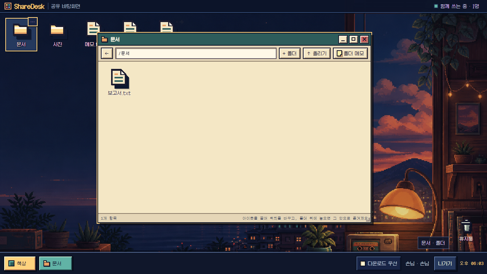

# ShareDesk

Google Drive 폴더 하나를 여러 사람이 함께 쓰는 도트 스타일 바탕화면으로 바꿔 주는 웹앱입니다. 파일과 폴더를 아이콘처럼 배치하고 창을 열어 미리 보거나 정리하는 구조입니다. 아이콘 위치와 파일 변경 내용은 참여자 모두에게 공유됩니다.



> 처음 설치한다면 [AI에게 설치 맡기기](#ai에게-설치-맡기기)부터 시작하세요. 직접 진행하려면 [OAuth 없이 로컬에서 실행하기](#oauth-없이-로컬에서-실행하기) 또는 [운영 설치](#운영-설치)를 따라가면 됩니다.

빠른 링크: [AI에게 맡기기](#ai에게-설치-맡기기) · [OAuth 없이 실행](#oauth-없이-로컬에서-실행하기) · [Google OAuth 발급](#1-google-cloud-프로젝트-만들기) · [Vercel 배포](#4-vercel에-배포) · [문제 해결](#문제-해결)

## AI에게 설치 맡기기

처음 설치한다면 아래 절차를 처음부터 직접 읽을 필요는 없습니다. 이 저장소를 열고 터미널 명령을 실행할 수 있는 코딩 에이전트에게 맡기세요. AI는 저장소와 현재 환경을 확인한 뒤, 직접 처리할 수 있는 명령과 파일 작업을 진행합니다. Google 로그인이나 Cloud Console 선택처럼 본인이 해야 하는 단계에서는 멈춰서 현재 화면에서 눌러야 할 곳을 설명해 달라고 하면 됩니다.

일반 채팅 AI보다는 로컬 저장소와 터미널을 다룰 수 있는 코딩 에이전트가 알맞습니다. 다만 `GOOGLE_CLIENT_SECRET`, `GOOGLE_REFRESH_TOKEN`, 인증 코드가 붙은 callback URL, `.env.local` 내용은 채팅에 붙이지 마세요. AI가 비밀값을 화면이나 로그에 출력하지 않고 로컬 파일 또는 배포 환경 변수에만 저장하도록 요청해야 합니다.

### 화면만 먼저 확인할 때

다음 내용을 코딩 에이전트에게 그대로 보내세요.

```text
이 저장소의 README.md와 package.json을 먼저 읽고 ShareDesk를 Google OAuth 없이 로컬에서 실행해줘.

- 내 운영체제, Node.js 버전, 현재 Git 상태부터 확인해.
- 기존 파일과 개발 데이터를 지우지 마.
- 필요한 설치와 `npm run setup -- --prepare-env`를 직접 실행해.
- `.env.local`은 local 저장소 모드로 준비하고 SESSION_SECRET은 새 무작위 값으로 만들어. 값 자체는 채팅이나 로그에 출력하지 마.
- `npm run dev`를 실행하고 접속 주소와 손님용 키 입력 위치를 알려줘.
- 가능하면 브라우저에서 파일 목록, 폴더 생성, 이름 변경, 삭제와 복원까지 확인해.
- Git push, 배포, Google Cloud 변경은 하지 마.
- 끝나면 무엇을 확인했고 무엇이 아직 미검증인지 나눠서 보고해.
```

이 방법은 내 컴퓨터에서만 실행됩니다. 인터넷에서 접속할 수 있는 서비스가 생기는 것은 아닙니다.

### 실제 Google Drive까지 연결할 때

아래 요청은 Google Cloud 설정부터 로컬 확인까지 이어서 진행하도록 구성했습니다.

```text
이 저장소의 README.md와 package.json을 먼저 읽고 실제 Google Drive를 연결한 ShareDesk 설치를 끝까지 도와줘.

- 내 운영체제와 저장소 상태를 먼저 확인하고, 터미널에서 할 수 있는 설치·검사·파일 수정은 직접 진행해.
- Google Cloud Console, Google 로그인, 계정 선택처럼 내가 직접 해야 하는 단계가 나오면 현재 화면에서 눌러야 할 메뉴와 입력값을 한 단계씩 설명하고 기다려.
- README에 적힌 Google Auth Platform의 Branding, Audience, Data Access, Clients 순서와 OAuth 범위를 그대로 따라.
- Audience 상태를 먼저 확인해. Testing이면 운영 전에 In production으로 바꿔야 하는지 설명하고, 이미 In production이면 그대로 둬. 실제 만료나 인증 실패 근거 없이 기존 refresh token을 폐기하거나 다시 발급하지 마.
- 먼저 `npm run setup -- --prepare-env`를 실행해 비밀 파일을 준비해. OAuth Client ID와 Client secret은 내가 로컬 파일에 직접 입력하도록 안내하고 채팅으로 요구하지 마.
- `GOOGLE_CLIENT_SECRET`, `GOOGLE_REFRESH_TOKEN`, 인증 코드가 붙은 callback URL, `.env.local` 내용은 화면·채팅·명령 기록에 출력하지 마.
- `npm run setup`과 `npm run dev`를 이어서 실행하고, 호스트 로그인과 기본 파일 작업까지 확인해.
- 실제 오류와 현재 상태를 확인한 뒤 다음 행동을 정하고, 추측으로 값을 만들지 마.
- Git push, Vercel 배포, 외부 서비스 변경은 내가 명시적으로 허용하기 전에는 하지 마.
- 끝나면 로컬 실행만 된 상태인지, 실제 운영 배포까지 끝난 상태인지 분명하게 구분해 보고해.
```

AI가 Google 계정의 비밀번호나 OAuth 비밀값을 대신 알아낼 수는 없습니다. 계정 선택과 동의, 비밀값 입력은 본인이 해야 합니다. 메뉴 이름이나 화면이 README와 다르면 Google과 Vercel 공식 문서를 확인하도록 요청하세요.

### 설치 후 사용법을 안내받을 때

설치를 마친 뒤에는 다음처럼 요청하면 관리자 기능을 한 단계씩 익힐 수 있습니다.

```text
이 저장소의 README와 현재 ShareDesk 화면을 보고 관리자 사용법을 안내해줘. 사용자 한 명 초대하기, 폴더와 파일 올리기, Google Drive 보기 권한으로 공유하기, 휴지통에서 복원하기, 특정 기기 로그인 끊기를 순서대로 진행하자. 내가 한 단계를 마쳤다고 말하면 다음 단계로 넘어가고, 삭제나 권한 회수처럼 되돌리기 어려운 작업은 실행 전에 확인해줘.
```

### 로컬 실행과 배포는 다릅니다

`npm run dev`가 성공해도 내 컴퓨터에서만 열린 상태입니다. 다른 사람이 접속할 운영 서비스가 되려면 코드를 원격 저장소에 올리고 Vercel 프로젝트와 환경 변수를 설정한 뒤 운영 OAuth callback과 실제 공개 주소까지 확인해야 합니다. AI에게 배포를 맡겼다면 마지막에 공개 URL을 직접 열어 로그인과 파일 목록이 작동하는지 확인해 달라고 요청하세요.

## 주요 기능

- 파일과 폴더를 바탕화면 아이콘으로 표시하고 아이콘 위치를 폴더별로 공유합니다.
- 폴더는 이동·크기 조절·최소화를 지원하는 창으로 열립니다.
- 파일 업로드, 다운로드, 이름 변경, 새 폴더 만들기, 폴더 간 이동을 지원합니다.
- 사진, 동영상, 오디오, PDF, 텍스트 파일을 바로 미리 봅니다. Google 문서·시트·슬라이드·드로잉은 PDF로 변환해 보여 줍니다.
- 휴지통은 삭제한 항목의 복원과 완전 삭제를 모두 지원합니다. 휴지통 보관 기간은 30일입니다.
- ShareDesk에는 관리자용 Google Drive 공유 기능도 있습니다. 승인 사용자에게 파일이나 폴더를 공유하면서 보기·편집 권한을 정합니다.
- 초대 링크는 지정한 Google 계정에서 한 번만 사용됩니다. 관리 화면에는 사용자 차단, 특정 기기 로그인 끊기, 모든 로그인 끊기 기능이 있습니다.
- 해 질 녘, 깊은 밤, 새벽, 밤바다 배경을 제공합니다. 배경 선택은 개인 브라우저에만 저장됩니다.

## 어떻게 동작하나요?

```text
호스트 Google 계정 ── 최초 1회 setup ──▶ Google Drive의 ShareDesk 폴더
                                                ▲
                                                │ Drive API
관리자 ── 1회용 초대 링크 ──▶ 참여자 로그인 ──▶ ShareDesk 서버
```

- Google Drive에 연결하는 계정은 호스트 한 명입니다. 참여자는 호스트의 Drive 용량을 함께 쓰며 자기 Drive 용량은 사용하지 않습니다.
- 별도 데이터베이스는 없습니다. 사용자, 초대, 공유 권한, 아이콘 배치는 Drive의 `ShareDesk/.sharedesk/` 폴더에 저장합니다.
- 브라우저만으로 동작하는 앱은 아닙니다. refresh token을 안전하게 보관하고 Drive API를 호출할 Next.js 서버 또는 Vercel 서버리스 환경이 필요합니다.
- 호스트 설정은 `drive.file` 권한을 요청합니다. 이 권한은 앱이 만들었거나 사용자가 명시적으로 접근을 허용한 파일에 한정됩니다. ShareDesk는 여기에 자체 루트 폴더 경계 검사도 적용합니다.
- 참여자 로그인은 이름과 이메일 확인에 필요한 `openid`, `email`, `profile`만 요청합니다. 참여자의 Drive 파일을 읽지 않습니다.
- 대용량 업로드는 서버가 파일 전체를 중계하지 않고 브라우저에서 Google Drive로 직접 전송합니다.
- 동시에 같은 항목을 수정하면 저장소 버전을 확인해 뒤늦은 쓰기를 거부하고 최신 상태를 다시 불러옵니다.

## OAuth 없이 로컬에서 실행하기

Google Cloud 설정 전에 UI와 파일 작업을 확인하는 개발 모드입니다. 파일은 프로젝트의 `.devstorage/`에 저장됩니다.

### 준비물

- [Node.js](https://nodejs.org/) 20.9 이상
- Git

### 실행

```powershell
git clone https://github.com/Youkamii/sharedesk.git
cd sharedesk
npm ci
npm run setup -- --prepare-env
```

이 명령은 `.env.local`을 먼저 소유자 전용 권한으로 준비합니다. 기존 파일이 있으면 내용을 덮어쓰지 않고 권한만 확인합니다.

`.env.local`에서 다음 값만 채우세요.

```dotenv
STORAGE_DRIVER=local
LOCAL_STORAGE_ROOT=.devstorage
SESSION_SECRET=local-development-only-change-this-value
ACCESS_KEYS=demo
```

이 예시 비밀값과 접속 키는 로컬 체험 전용입니다. 인터넷에 공개된 배포에서는 새 값을 사용해야 합니다.

```powershell
npm run dev
```

브라우저에서 `http://localhost:3000`을 열고 `demo`를 손님용 키로 입력하세요. 이 모드에서는 Google 로그인, 사용자별 초대, 실제 Drive 공유를 확인할 수 없습니다.

---

# 운영 설치

운영 설치는 다음 순서로 진행합니다.

1. Google Cloud 프로젝트와 OAuth 클라이언트를 만드세요.
2. 로컬에서 `npm run setup`을 실행해 호스트 Drive를 연결하세요.
3. 로컬 로그인이 되는지 확인하세요.
4. Vercel의 고정 운영 주소를 Google OAuth와 환경 변수에 등록하세요.
5. `/admin`에서 참여자별 초대 링크를 만드세요.

## 1. Google Cloud 프로젝트 만들기

### 1-1. 프로젝트와 Drive API

1. [Google Cloud Console](https://console.cloud.google.com/)을 여세요.
2. 상단 프로젝트 선택 메뉴에서 새 프로젝트를 만드세요.
3. `API 및 서비스` → `라이브러리`로 이동하세요.
4. `Google Drive API`를 검색해 **사용**을 누르세요.

OAuth 클라이언트와 Drive API는 같은 Google Cloud 프로젝트에 있어야 합니다.

### 1-2. Google Auth Platform의 Branding

왼쪽 메뉴에서 `Google Auth Platform` → `Branding`으로 이동하세요.

1. 앱 이름을 입력하세요. 예: `우리 팀 ShareDesk`
2. 사용자 지원 이메일을 고르세요.
3. 개발자 연락처 이메일을 입력하세요.
4. 홈 페이지나 로고는 선택 사항입니다. 공개 서비스라면 실제 운영 주소와 개인정보처리방침을 준비하세요.

화면 이름은 Google Cloud 계정 언어에 따라 `브랜딩`, `대상`, `데이터 액세스`, `클라이언트`처럼 번역되어 보일 수 있습니다.

### 1-3. Audience 설정

`Google Auth Platform` → `Audience`로 이동하세요.

- 개인 Google 계정이나 여러 조직의 계정을 초대할 예정이면 **External**을 선택합니다.
- 한 Google Workspace 조직 안에서만 쓸 때는 조직 정책에 따라 **Internal**을 선택할 수 있습니다. Internal 앱에는 조직 밖 계정이 로그인할 수 없습니다.

호스트 Drive를 오래 연결해 둘 운영 환경이라면 **Publish app**을 눌러 상태를 **In production**으로 바꾼 뒤 setup을 진행하세요.

이미 **In production**이라면 이 단계는 끝난 것입니다. 새 배포 주소를 추가하더라도 Audience 상태나 기존 refresh token을 다시 건드릴 필요는 없습니다.

Testing 상태에서도 설치할 수는 있지만, ShareDesk 호스트 설정은 `drive.file`과 오프라인 접근을 함께 요청하므로 그 상태에서 발급된 refresh token은 보통 7일 뒤 만료됩니다. 이미 Testing 상태에서 setup했다면 In production으로 전환한 뒤 [호스트 Drive 연결](#2-호스트-drive-연결)을 다시 진행하세요.

> `In production`은 앱을 앱스토어처럼 공개한다는 뜻이 아닙니다. External 앱의 토큰을 테스트용 만료 정책에서 벗어나게 하는 게시 상태입니다. `drive.file`은 Google이 권장하는 비민감 Drive 범위이므로, 이 범위만 쓰는 기본 ShareDesk 설정에는 민감·제한 범위 심사가 보통 필요하지 않습니다.

자세한 내용은 Google의 [OAuth 동의 화면 구성 안내](https://developers.google.com/workspace/guides/configure-oauth-consent)와 [Audience 설정 안내](https://support.google.com/cloud/answer/15549945?hl=ko)를 참고하세요.

### 1-4. Data Access에 권한 범위 추가

`Google Auth Platform` → `Data Access`에서 **Add or remove scopes**를 누르고 다음 네 범위를 추가하세요.

```text
openid
https://www.googleapis.com/auth/userinfo.email
https://www.googleapis.com/auth/userinfo.profile
https://www.googleapis.com/auth/drive.file
```

검색창에서 범위 전체 주소를 붙여 넣으면 찾기 쉽습니다. 저장한 뒤 네 항목이 모두 목록에 있는지 확인하세요. ShareDesk 코드도 정확히 이 범위만 요청합니다. Drive 범위의 차이는 Google의 [Drive API 권한 범위 안내](https://developers.google.com/workspace/drive/api/guides/api-specific-auth)에서 확인할 수 있습니다.

### 1-5. Web application 클라이언트 만들기

`Google Auth Platform` → `Clients` → `Create client`로 이동하세요.

1. Application type은 **Web application**을 선택하세요. Desktop app을 고르면 운영 웹 주소를 같은 클라이언트에 연결할 수 없습니다.
2. 이름은 알아보기 쉽게 정하세요. 예: `ShareDesk web`
3. **Authorized JavaScript origins는 비워 두세요.** ShareDesk는 Google JavaScript SDK를 사용하지 않습니다.
4. **Authorized redirect URIs**에 아래 두 주소를 정확히 등록하세요.

```text
http://127.0.0.1:53682/callback
http://localhost:3000/api/auth/google/callback
```

고정 운영 도메인이 이미 있다면 세 번째 주소도 추가하세요.

```text
https://sharedesk.example.com/api/auth/google/callback
```

`sharedesk.example.com`은 실제 운영 도메인으로 바꾸세요. Vercel의 커밋별 Preview URL은 주소가 바뀌므로 등록하지 않습니다.

기존 클라이언트와 운영 주소가 있다면 새 클라이언트를 만들지 마세요. 현재 주소가 목록에 있는지 확인하고, 빠진 운영 callback만 추가하면 됩니다.

리디렉션 주소는 스킴(`http`/`https`), 호스트, 포트, 경로, 끝 슬래시까지 일치해야 합니다. 로컬 주소의 HTTP 사용은 localhost 예외로 허용됩니다. 자세한 규칙은 Google의 [OAuth 웹 서버 안내](https://developers.google.com/identity/protocols/oauth2/web-server#uri-validation)를 참고하세요.

클라이언트를 만들면 다음 두 값을 즉시 안전한 곳에 보관하세요.

- Client ID
- Client secret

Client secret은 생성 직후에만 화면에 보일 수 있습니다. 공개 저장소, 채팅, 이슈, 스크린샷에 남기지 마세요. 놓쳤다면 기존 값을 추측하지 말고 Clients 화면에서 새 secret을 발급하세요.

## 2. 호스트 Drive 연결

### 2-1. 로컬 환경 파일 준비

저장소를 아직 받지 않았다면 먼저 설치하세요.

```powershell
git clone https://github.com/Youkamii/sharedesk.git
cd sharedesk
npm ci
npm run setup -- --prepare-env
```

`--prepare-env`는 기존 `.env.local`을 절대 덮어쓰지 않습니다. 파일이 없으면 먼저 소유자 전용으로 잠근 뒤 `.env.example` 내용을 채웁니다. 이미 있으면 내용은 그대로 둔 채 권한만 확인합니다. Windows에서는 현재 사용자만 접근할 수 있게 합니다. macOS와 Linux에서는 `0600`으로 맞춥니다. 권한 설정이나 확인에 실패하면 비밀값을 쓰지 않고 중단합니다.

`.env.local`에 방금 받은 값만 먼저 입력하세요.

```dotenv
GOOGLE_CLIENT_ID=발급받은-client-id
GOOGLE_CLIENT_SECRET=발급받은-client-secret
```

따옴표는 필요하지 않습니다. `=` 뒤에 앞뒤 공백 없이 붙여 넣으세요.

### 2-2. setup 시작

```powershell
npm run setup
```

터미널에 긴 Google 인증 URL이 표시됩니다.

1. URL 전체를 복사해 브라우저에서 여세요.
2. ShareDesk의 호스트가 될 Google 계정으로 로그인하세요.
3. 표시된 권한을 확인하고 동의하세요.
4. 브라우저가 `http://127.0.0.1:53682/callback?...`으로 이동합니다.
5. `사이트에 연결할 수 없음` 같은 오류가 떠도 정상입니다. setup은 로컬 콜백 서버를 계속 띄워 두지 않습니다.
6. 주소창의 주소 전체를 복사하세요.

콜백 주소에는 짧은 시간 동안 쓸 수 있는 일회용 인증 코드가 들어 있습니다. **그 주소는 같은 컴퓨터의 터미널에만 붙여 넣고, 채팅·이슈·스크린샷으로 공유하지 마세요.**

### 2-3. setup 완료

PowerShell에서 아래 명령을 실행하세요. 질문이 나오면 복사한 주소 전체를 붙여넣습니다. 주소를 명령줄 인자로 넣지 않으므로 셸 명령 기록에는 인증 코드가 남지 않습니다.

```powershell
npm run setup -- --finish
```

정상적으로 끝나면 setup이 다음 작업을 합니다.

- 호스트 이메일을 `ADMIN_EMAILS`에 기록합니다.
- Google refresh token을 `.env.local`에만 저장합니다.
- 호스트 Drive에 `ShareDesk` 루트 폴더와 `.sharedesk` 상태 폴더를 만듭니다.
- `users.json`, `drive-shares.json`을 준비합니다. 같은 이름의 기존 상태 파일이 있으면 덮어쓰지 않고 보존합니다.
- 세션 서명용 `SESSION_SECRET`을 만듭니다.
- `STORAGE_DRIVER=drive`, `DRIVE_ROOT_FOLDER_ID`, `DRIVE_STATE_FOLDER_ID`를 기록합니다.

`.env.local`은 비밀 파일입니다. Git에 올리거나 다른 사람에게 통째로 보내지 마세요. setup 도중 문제가 생겼더라도 파일 내용을 이슈에 붙이지 마세요.

## 3. 로컬에서 확인

```powershell
npm run dev
```

1. `http://localhost:3000`을 여세요.
2. **Google 계정으로 로그인**을 누르세요.
3. setup에 사용한 호스트 계정으로 로그인하세요.
4. `/files` 바탕화면과 `/admin` 관리 화면이 열리는지 확인하세요.
5. 테스트 폴더 하나를 만들고 이름 변경과 삭제·복원을 확인하세요.

로그인 과정에서 Google은 참여자용 `openid`, `email`, `profile`만 요청합니다. Drive 권한은 setup에서 받은 호스트 토큰을 서버가 사용합니다.

## 4. Vercel에 배포

### 4-1. 고정 운영 주소 정하기

GitHub 저장소를 Vercel 프로젝트로 가져오세요. Vercel이 제공한 고정 Production 주소(예: `https://my-sharedesk.vercel.app`)를 쓰거나 직접 연결한 도메인을 사용하세요.

커밋마다 달라지는 Preview URL은 OAuth 운영 주소로 쓰지 않습니다. 처음 설치하는 경우 Google 비밀값도 Production 환경에만 넣는 편이 단순합니다.

### 4-2. Google 클라이언트에 운영 콜백 추가

Google Cloud Console의 `Google Auth Platform` → `Clients` → 앞에서 만든 클라이언트를 여세요. Authorized redirect URIs에 다음 주소를 추가하세요.

```text
https://실제-운영-도메인/api/auth/google/callback
```

저장한 뒤 적용까지 몇 분 걸릴 수 있습니다.

이 작업은 기존 OAuth 설정을 다시 만드는 절차가 아닙니다. 기존 Client ID, Audience 상태, refresh token은 유지하고 새 운영 주소만 목록에 더합니다.

### 4-3. Production 환경 변수 입력

Vercel 프로젝트의 `Settings` → `Environment Variables`에서 아래 값을 **Production** 환경에 입력하세요.

| 이름 | 값 |
|---|---|
| `ADMIN_EMAILS` | 관리자 Google 이메일. 여러 명이면 쉼표로 구분 |
| `SESSION_SECRET` | setup이 만든 긴 무작위 값 |
| `STORAGE_DRIVER` | `drive` |
| `PUBLIC_BASE_URL` | `https://실제-운영-도메인` |
| `GOOGLE_CLIENT_ID` | Google OAuth Client ID |
| `GOOGLE_CLIENT_SECRET` | Google OAuth Client secret |
| `GOOGLE_REFRESH_TOKEN` | setup이 발급받은 호스트 refresh token |
| `DRIVE_ROOT_FOLDER_ID` | setup이 만든 ShareDesk 폴더 ID |
| `DRIVE_STATE_FOLDER_ID` | setup이 만든 `.sharedesk` 폴더 ID |

`PUBLIC_BASE_URL`에는 origin만 입력합니다. 경로, 끝 슬래시, `/api/auth/google/callback`, Vercel Preview URL을 붙이지 마세요. 이 값은 OAuth 콜백뿐 아니라 초대 링크 주소에도 사용합니다.

`ACCESS_KEYS`는 임시 손님용 키 로그인을 쓸 때만 추가합니다. `LOCAL_STORAGE_ROOT`와 `SHAREDESK_SHARE_TEST_EMAIL`은 운영 배포에 넣지 않습니다. 비밀값에 `NEXT_PUBLIC_` 접두사를 붙이면 브라우저에 공개될 위험이 있으므로 사용하지 마세요.

Vercel 환경 변수는 값을 바꿔도 이미 만들어진 배포에 자동 반영되지 않습니다. 입력이나 수정이 끝나면 Production을 **Redeploy**하세요. 자세한 내용은 [Vercel 환경 변수 안내](https://vercel.com/docs/environment-variables)를 참고하세요.

### 4-4. 운영 확인

1. 운영 주소의 `/`에서 호스트 Google 계정으로 로그인하세요.
2. `/files`에서 테스트 폴더를 만들고 새로고침 뒤에도 남는지 확인하세요.
3. `/admin`을 열어 관리자 화면이 열리는지 확인하세요.
4. 로그아웃한 뒤 다시 로그인해 OAuth 콜백이 운영 도메인으로 돌아오는지 확인하세요.

## 5. 사람 초대하기

1. 관리자가 운영 주소의 `/admin`을 엽니다.
2. 받을 사람의 이름과 **실제로 로그인할 Google 이메일**을 입력합니다.
3. 필요하면 비고를 남기고 초대 링크를 만듭니다.
4. 링크를 받을 사람에게 안전한 채널로 전달합니다.
5. 받는 사람이 지정된 Google 계정으로 로그인하면 링크가 사용 완료되고 바로 승인됩니다.

초대 링크는 일회용이며 지정한 이메일과 다른 Google 계정에서는 작동하지 않습니다. 관리자는 사용 전 링크를 비활성화하거나 새 링크로 바꿀 수도 있습니다.

관리 화면에서 할 수 있는 일은 다음과 같습니다.

| 작업 | 결과 |
|---|---|
| 승인 | 바탕화면 입장을 허용합니다. |
| 차단 | 다음 요청부터 접근을 막고 기존 로그인 세션을 무효화합니다. |
| 이 로그인 끊기 | 선택한 기기의 해당 로그인만 끊습니다. 다른 기기의 로그인은 유지됩니다. |
| 모든 로그인 끊기 | 그 사용자의 모든 기기에서 발급된 로그인을 한꺼번에 끊습니다. |
| 승인 대기로 변경 | 접근을 멈추고 다시 승인할 때까지 기다리게 합니다. |
| 사용자 삭제 | 사용자 명단에서 지웁니다. 다시 들어오려면 새 초대가 필요합니다. |

`ADMIN_EMAILS`에 적힌 계정은 관리자입니다. 관리자 계정을 바꾸었다면 Vercel 환경 변수를 수정한 뒤 다시 배포하세요.

ShareDesk는 새 Google 로그인마다 간단한 브라우저·운영체제 이름과 로그인 시각을 기록하고 사용자별로 최근 로그인 기록 20개만 보관합니다. 이 기능을 추가하기 전에 발급된 예전 쿠키는 기기 목록에 나타나지 않을 수 있습니다. 업그레이드 직후 예전 쿠키까지 확실히 정리하려면 **모든 로그인 끊기**를 한 번 실행하세요.

## Google Drive로 직접 공유하기

관리자가 파일이나 폴더를 우클릭하면 **Google Drive로 공유** 항목이 나타납니다. `/admin`에 등록된 승인 사용자에게 보기 또는 편집 권한을 줍니다.

이 기능은 ShareDesk 안에서 항목을 숨기거나 공개하는 기능이 아닙니다. 받는 사람의 Google Drive `공유 문서함(Shared with me)`에도 항목이 나타나게 하는 실제 Drive 권한입니다. 폴더 권한은 Google Drive 규칙에 따라 하위 항목에 이어집니다.

실제 공유 자동 검사는 별도 테스트 Google 계정이 있어야 합니다. 자세한 실행법은 [실제 Drive 검사](#실제-drive-검사)를 참고하세요. 받는 사람의 `공유 문서함` 화면과 보기·편집 역할 차이는 해당 계정으로 직접 확인해야 합니다.

---

# 문제 해결

| 증상 | 확인할 내용 |
|---|---|
| `redirect_uri_mismatch` | 오류에 나온 주소와 Clients에 등록한 URI를 글자 단위로 비교하세요. 같은 Client ID인지, `localhost`와 `127.0.0.1`, 포트, 경로, 끝 슬래시가 다른지 확인합니다. |
| `앱에 액세스할 수 없음` | Audience가 External인지 확인합니다. Testing을 유지한다면 로그인 계정을 Test user에 넣어야 합니다. |
| `org_internal` | Internal 앱에 조직 밖 Google 계정으로 로그인한 경우입니다. External로 바꾸거나 조직 계정을 사용하세요. |
| 동의 뒤 `127.0.0.1` 연결 실패 | setup에서는 정상입니다. 주소창 전체를 복사하고 `npm run setup -- --finish`를 실행한 뒤, 질문이 나오면 붙여넣으세요. |
| 콜백 주소에 `code`가 없음 | 동의를 취소했거나 오류가 난 주소입니다. `npm run setup`부터 다시 시작하고 주소 전체를 복사하세요. |
| `refresh_token을 받지 못했습니다` | [Google 계정의 연결된 앱](https://myaccount.google.com/permissions)에서 이 앱 권한을 제거한 뒤 setup을 다시 실행하세요. |
| 약 7일 뒤 Drive 연결이 끊김 | 먼저 Audience가 실제로 Testing인지 확인하세요. Testing에서 발급한 호스트 토큰이라면 In production 전환 뒤 setup을 다시 진행할 수 있습니다. 이미 In production이면 이 원인에 해당하지 않으므로 기존 토큰을 먼저 폐기하지 말고 실제 인증 오류를 확인하세요. |
| Drive API가 403을 반환 | OAuth 클라이언트를 만든 것과 같은 Cloud 프로젝트에서 Google Drive API가 켜져 있는지 확인하세요. Workspace 관리 정책이 외부 앱을 막는지도 확인합니다. |
| Vercel에서만 로그인이 실패 | Production 환경 변수, `PUBLIC_BASE_URL`, 운영 redirect URI를 확인하고 환경 변수 변경 뒤 Redeploy했는지 확인하세요. |
| 초대 링크가 localhost나 다른 도메인으로 생성 | `PUBLIC_BASE_URL`을 실제 운영 origin으로 바꾸고 다시 배포하세요. |
| 특정 Workspace 계정만 실패 | 조직 관리자의 서드파티 앱 접근 제한이나 Google Advanced Protection 정책을 확인하세요. |
| 관리자 로그인이 초대를 요구 | 로그인 이메일이 `ADMIN_EMAILS`와 정확히 같은지 확인하고 환경 변수를 바꿨다면 다시 배포하세요. |
| setup이 같은 이름의 상태 파일이 여러 개라고 중단 | Drive의 `ShareDesk/.sharedesk/`에서 해당 JSON 파일을 확인하세요. 내용을 비교해 보존할 파일 하나만 남긴 뒤 다시 실행해야 합니다. |

## setup을 다시 실행해도 되나요?

기존 `DRIVE_ROOT_FOLDER_ID`와 상태 폴더 ID가 `.env.local`에 있으면 setup은 그 폴더를 이어서 사용합니다. 기존 상태 JSON도 덮어쓰지 않습니다.

다만 `.sharedesk` 안에 같은 이름의 핵심 상태 파일이 여러 개라면 setup은 임의로 하나를 고르지 않고 중단합니다. 이 경우 Drive에서 내용을 직접 확인한 다음 하나만 남겨야 합니다.

Google Client secret을 교체했거나 refresh token을 다시 받아야 한다면 `.env.local`의 Client ID와 secret을 먼저 갱신하고 setup을 다시 시작하세요.

---

# 설정 참고

## 환경 변수

| 변수 | 필수 여부 | 설명 |
|---|---:|---|
| `ADMIN_EMAILS` | 운영 필수 | 관리자 Google 이메일. 여러 개면 쉼표로 구분합니다. |
| `SESSION_SECRET` | 필수 | 로그인 쿠키 서명 비밀입니다. 16자 이상이어야 하며 setup이 안전한 값을 만듭니다. |
| `STORAGE_DRIVER` | 필수 | 운영은 `drive`, OAuth 없는 개발은 `local`입니다. |
| `PUBLIC_BASE_URL` | 운영 필수 | 고정 운영 origin입니다. 경로와 끝 슬래시를 넣지 않습니다. |
| `GOOGLE_CLIENT_ID` | Drive/로그인 필수 | Web application 유형의 OAuth Client ID입니다. |
| `GOOGLE_CLIENT_SECRET` | Drive/로그인 필수 | OAuth Client secret입니다. |
| `GOOGLE_REFRESH_TOKEN` | Drive 필수 | setup이 받은 호스트의 오프라인 토큰입니다. |
| `DRIVE_ROOT_FOLDER_ID` | Drive 필수 | ShareDesk가 관리할 루트 폴더 ID입니다. |
| `DRIVE_STATE_FOLDER_ID` | Drive 필수 | `.sharedesk` 상태 폴더 ID입니다. |
| `ACCESS_KEYS` | 선택 | 쉼표로 구분한 임시 손님용 키입니다. 사용자별 관리가 필요하면 초대를 사용하세요. |
| `LOCAL_STORAGE_ROOT` | local 전용 | 로컬 파일 저장 경로입니다. 기본값은 `.devstorage`입니다. |
| `SHAREDESK_SHARE_TEST_EMAIL` | 검사 전용 | 실제 Drive 공유 검사를 받을 별도 Google 계정입니다. 운영 환경에는 넣지 않습니다. |

## 명령어

| 명령 | 용도 |
|---|---|
| `npm run dev` | 개발 서버를 실행합니다. |
| `npm run build` | 운영 빌드가 만들어지는지 확인합니다. |
| `npm start` | 만들어진 운영 빌드를 실행합니다. |
| `npm run lint` | ESLint 검사를 실행합니다. |
| `npm test` | 저장소의 자동 테스트를 실행합니다. |
| `npm run setup` | 호스트 Google 인증을 시작합니다. |
| `npm run setup -- --check` | Client ID와 secret을 읽고 인증 URL을 만들 수 있는지 확인합니다. |
| `npm run test:drive-operations` | 실제 Drive에서 생성·업로드·다운로드·이름 변경·이동·삭제·복원을 검사합니다. |
| `npm run test:drive-preview` | 실제 Drive에서 미리보기 변환·다운로드 경로를 검사합니다. |
| `npm run test:drive-sharing` | 실제 Drive 공유 권한 생성·변경·회수를 검사합니다. |

## 실제 Drive 검사

세 검사는 `.env.local`의 실제 Drive 설정을 사용합니다. 테스트 파일을 만들거나 권한을 바꾸므로 개인 작업용이 아닌 검증 가능한 ShareDesk 루트에서 실행하세요.

먼저 기본 파일 작업 전체를 확인합니다.

```powershell
npm run test:drive-operations
```

미리보기 변환과 범위 다운로드는 별도로 검사합니다.

```powershell
npm run test:drive-preview
```

공유 검사는 `/admin` 초대를 거쳐 승인된 별도 Google 계정이 필요합니다.

```dotenv
SHAREDESK_SHARE_TEST_EMAIL=recipient@example.com
```

```powershell
npm run test:drive-sharing
```

검사는 임시 파일과 자신이 만든 권한을 정리합니다. 그래도 받는 사람 계정의 Google Drive `공유 문서함`에 실제로 표시되는지, 보기 권한에서는 수정이 거부되고 편집 권한에서는 허용되는지도 받는 사람 계정에서 직접 확인해야 합니다.

## 상태 저장과 동시 편집

Drive 모드에서는 `ShareDesk/.sharedesk/`에 다음 상태를 둡니다.

- `users.json`: 사용자, 초대, 승인·차단 상태, 최근 로그인 기기
- `drive-shares.json`: ShareDesk가 만든 Google Drive 공유 권한
- `desktop-layout-*.json`: 폴더별 아이콘 좌표와 버전

일반 파일 목록에서는 `.sharedesk`를 숨기고 그 안을 열지 못하게 막습니다. 상태 변경은 Drive가 발급한 버전과 조건부 쓰기를 사용합니다. 다른 사용자가 먼저 바꾼 경우 늦은 요청은 409 충돌로 끝나며 클라이언트가 최신 목록을 다시 읽습니다.

## 제한 사항

- ShareDesk가 다루는 범위는 setup으로 정한 Drive 루트 폴더 안쪽입니다. 호스트가 Drive 웹에서 항목을 루트 밖으로 옮기면 ShareDesk에서 접근하지 못합니다.
- 같은 폴더에 같은 이름의 항목을 만들거나 이름을 바꾸는 작업은 거부됩니다.
- HTML, SVG처럼 스크립트 실행이 가능한 형식은 브라우저에서 바로 미리 보지 않고 다운로드로 제공합니다.
- Google 문서·시트·슬라이드·드로잉은 PDF 변환 미리보기를 사용합니다. 다른 Google 네이티브 형식은 지원하지 않습니다.
- 무료 Google Drive 용량은 호스트 계정 정책을 따릅니다.
- 접속 키 로그인은 IP당 분당 10회와 서버 전체 분당 60회로 시도를 제한합니다.
- 휴지통의 30일 정리는 Drive API가 삭제 시각을 따로 주지 않아 ShareDesk가 기록한 목록을 기준으로 처리합니다.

## 기여하기

변경 전 `npm test`, `npm run lint`, `npm run build`를 실행해 주세요. 버그를 제보할 때는 재현 순서와 브라우저·Node.js 버전을 적되, `.env.local`, OAuth 콜백 주소, 토큰, Client secret은 절대 첨부하지 마세요.

현재 저장소에는 별도 라이선스 파일이 없습니다. 재사용이나 배포 조건이 필요하면 저장소 관리자에게 먼저 확인하세요.
