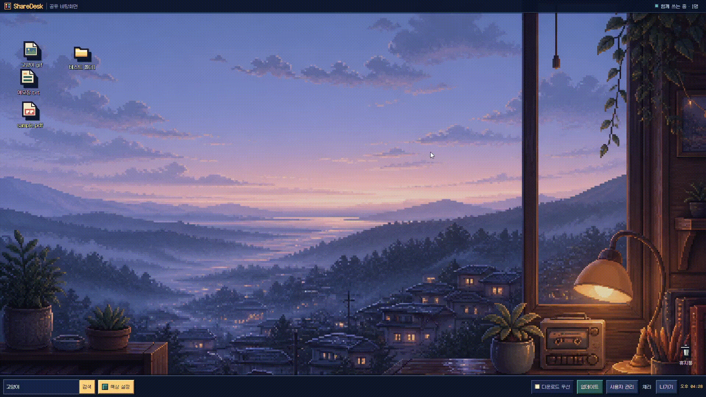
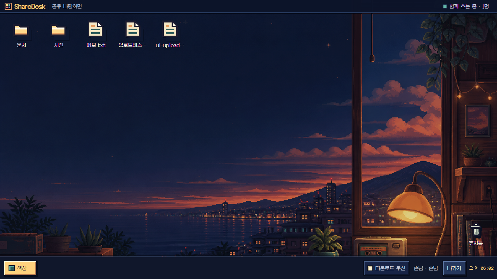
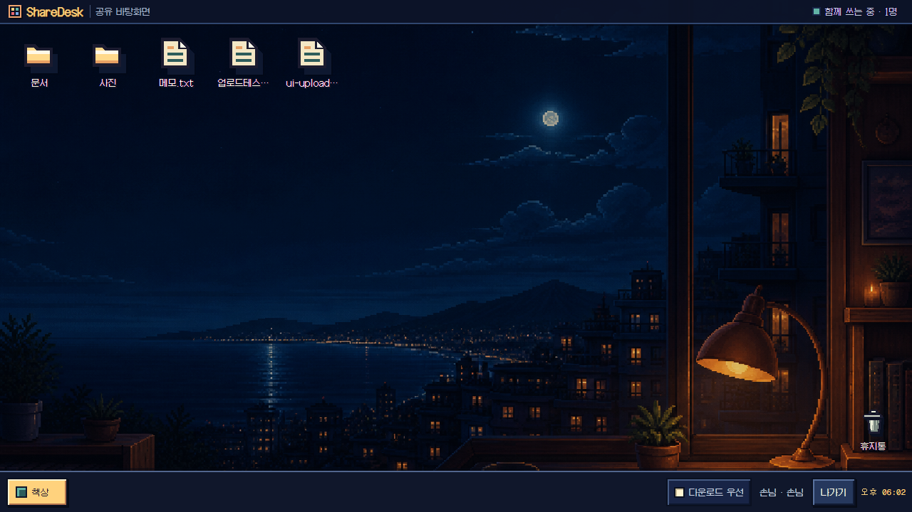
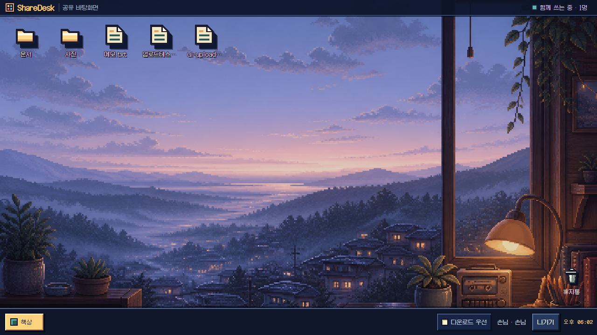
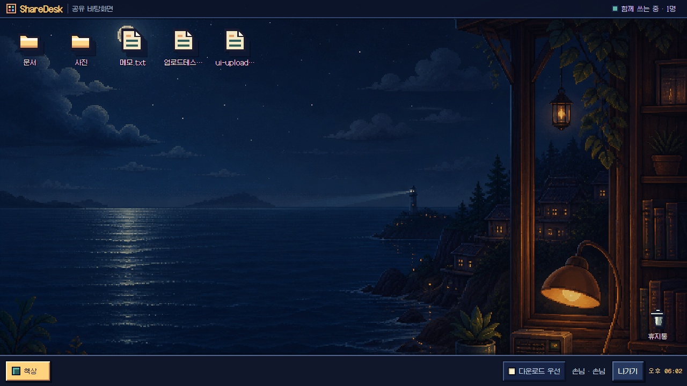

# ShareDesk

### 语言

[English](./README.md) · [한국어](./README.ko.md) · [日本語](./README.ja.md) · [हिन्दी](./README.hi.md) · **中文**

ShareDesk 是**一个共享文件空间：多个人用各自的 Google 账号，一起使用同一个人的 Google Drive 存储空间**。只有站长需要安装一次；参与者只要在同一个地址登录、输入邀请码，就能一起使用相同的文件和文件夹。



## 四种壁纸

| 黄昏 | 深夜 |
| :---: | :---: |
|  |  |
| **黎明** | **夜海** |
|  |  |

## 你可以做什么

- 像桌面图标一样摆放文件和文件夹，并把文件夹当作窗口打开，一起整理。
- 根据自己的角色，可以上传、下载、重命名文件，在文件夹之间移动文件，以及从回收站恢复。
- 直接查看照片、视频、音频、PDF 和文本，并且可以一起编辑 `.txt` 文件。
- 在每个文件夹上留下共享备注。
- 用邀请码邀请成员，并查看当前谁在线。
- 给每个人分配四种角色之一——管理员、可编辑、可上传、仅查看——并可随时在管理页面更改。
- 界面支持五种语言——英语、韩语、日语、印地语和中文。管理员在设置标签页中确定桌面语言（默认英语），开启“允许个人语言”后，参与者也能各自选择自己的界面语言。
- 从四种壁纸中挑选符合当下心情的一种；选择会保存在每个人的浏览器里。

## 如何共享？

```text
  站长一个人的 Google Drive
             ↕
     同一个 ShareDesk 地址
   ├─ 站长的 Google 账号
   ├─ 参与者 A 的 Google 账号
   └─ 参与者 B 的 Google 账号
```

只有站长的账号会连接 Google Drive。参与者用各自的 Google 账号登录，但在 ShareDesk 里，大家共同使用站长指定的那一个 Drive 文件夹的文件和容量。ShareDesk 绝不会读取参与者个人的 Drive 文件。

用户、邀请、文件夹备注、图标布局等共享状态也保存在站长的 Drive 里，不需要单独的数据库。

## 开始使用

- **如果觉得配置太难：** [让 AI 帮你搭建](./docs/AI_INSTALL.zh.md)
- **想自己运行生产服务器：** [详细安装指南](./docs/INSTALL.zh.md)
- **已经安装过：** [更新指南](./docs/UPDATE.zh.md)
- **只想在自己电脑上一个人使用：** [本地个人使用](./docs/LOCAL.zh.md)

受邀的参与者不需要安装任何东西。打开站长发来的 ShareDesk 地址登录，输入邀请码即可。

---

<div align="center">
<sub>Licensed under the <a href="LICENSE">MIT License</a> · Galmuri font under the <a href="public/fonts/Galmuri-LICENSE.txt">SIL OFL 1.1</a></sub>
</div>
